[](https://github.com/gongahkia/garuda/releases/tag/1.0.0) 
[](https://github.com/gongahkia/garuda/releases/tag/2.0.0) 

# `Garuda`

*"We have [Wanderlog](https://wanderlog.com) at home"*, featuring [user accounts](#login-main-dashboard-add-locations), [dynamic ordering](#reorder-locations-pin-location-delete-location) and [itinerary management](#add-location-notes-edit-notes-cycle-through-locations).

Made to teach myself to work with [vue-google-maps](https://github.com/fawmi/vue-google-maps) and [Google Maps Platform API](https://developers.google.com/maps/documentation/javascript/get-api-key).

## Stack

* *Frontend*: [Vue.js](https://vuejs.org/), [Vite](https://vitejs.dev/), [@fawmi/vue-google-maps](https://github.com/fawmi/vue-google-maps)
* *API*: [Google Maps Platform API](https://developers.google.com/maps)
* *Auth*: [Clerk](https://clerk.com/)
* *DB*: [Firebase Realtime Database](https://firebase.google.com/docs/database), [Supabase Realtime Database](https://supabase.com/docs/guides/realtime), [YJS](https://github.com/yjs/yjs)
* *AI*: [OpenAI GPT-4o](https://platform.openai.com/docs/models/gpt-4o) 

## Screenshots

### Login, Main Dashboard, Add Locations

<div style="display: flex; justify-content: space-between;">
  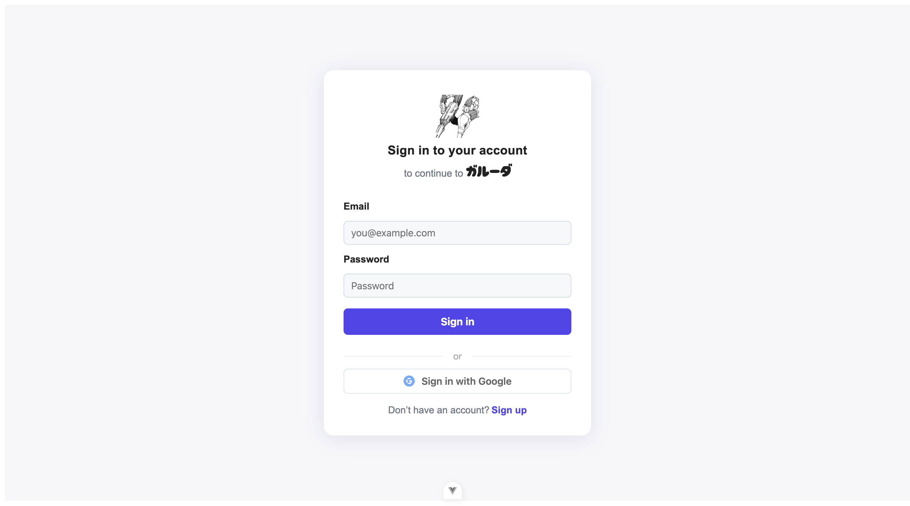
  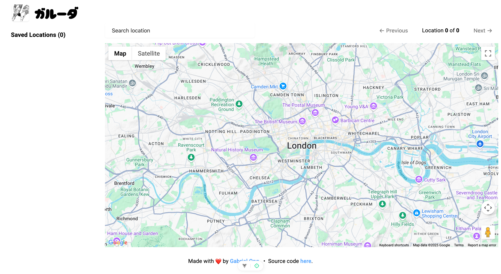
  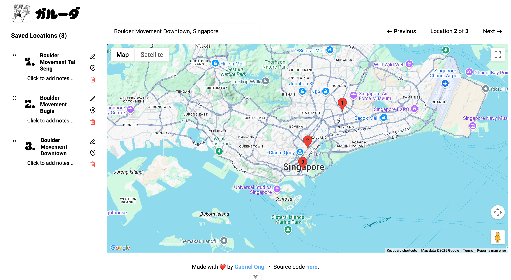
</div>

### Add Location Notes, Edit notes, Cycle through Locations

<div style="display: flex; justify-content: space-between;">
  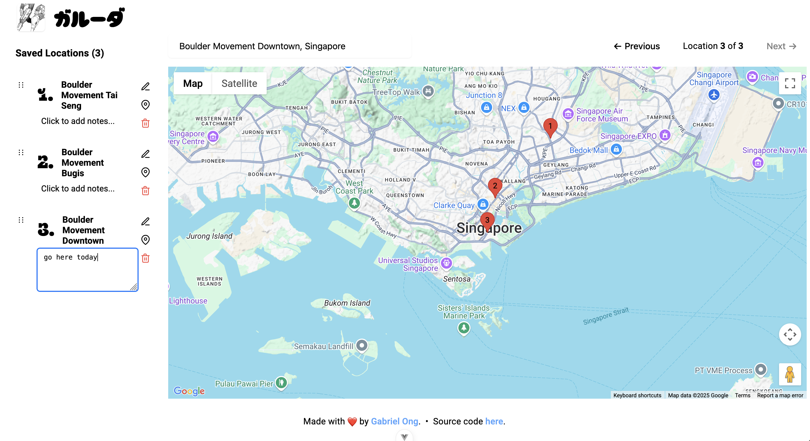
  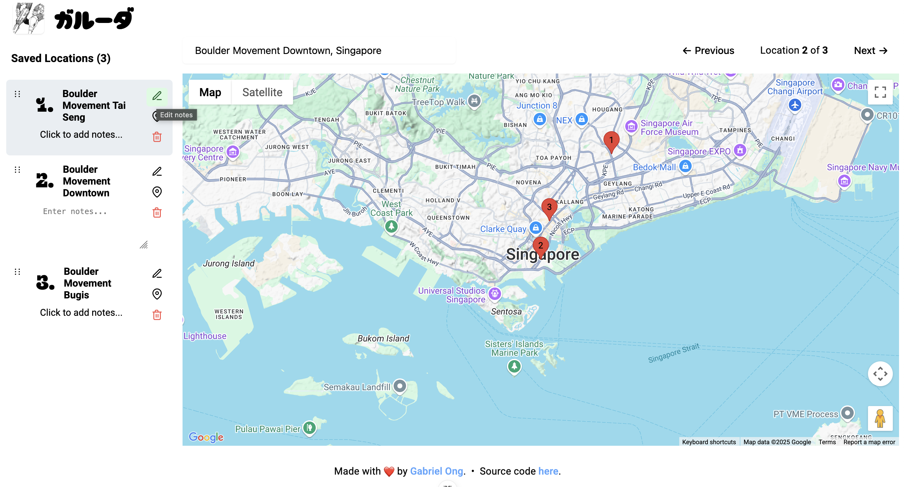
  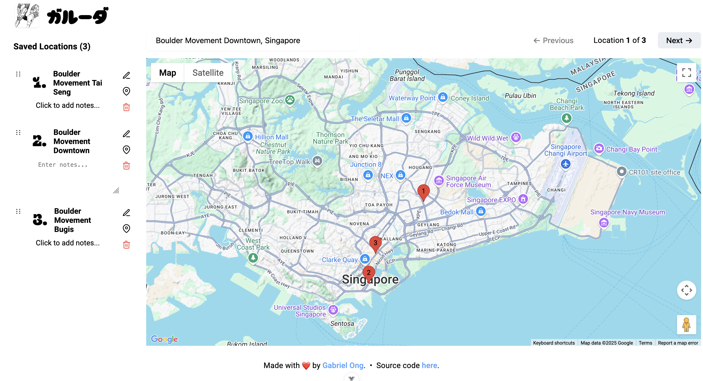
</div>

### Reorder Locations, Pin Location, Delete Location

<div style="display: flex; justify-content: space-between;">
  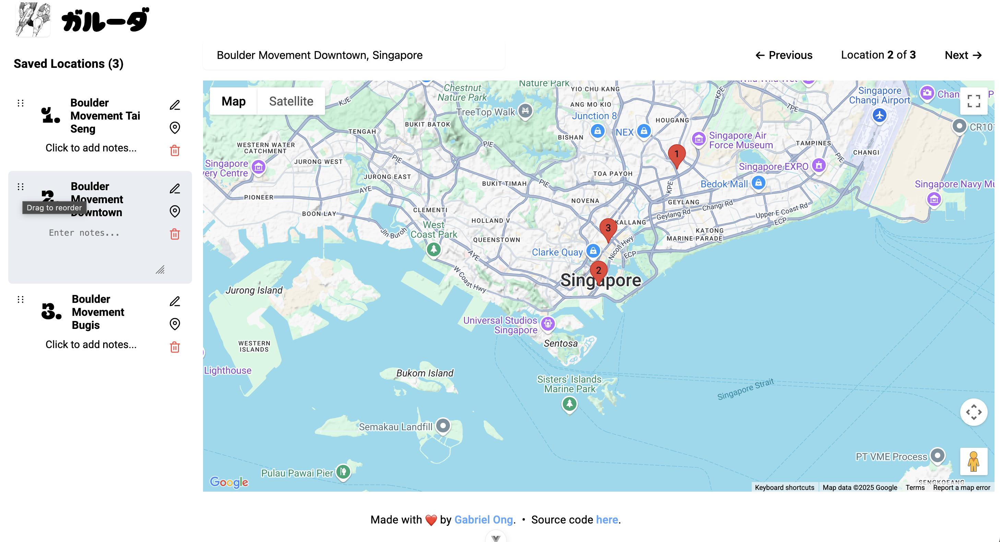
  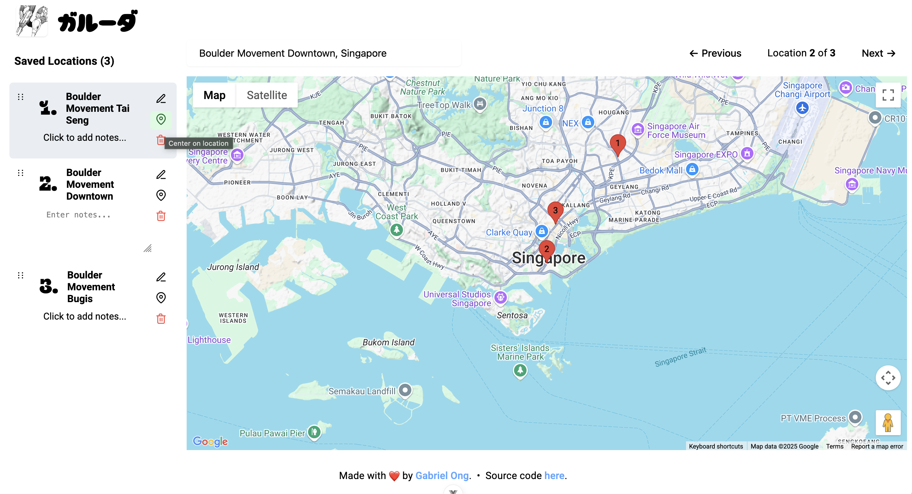
  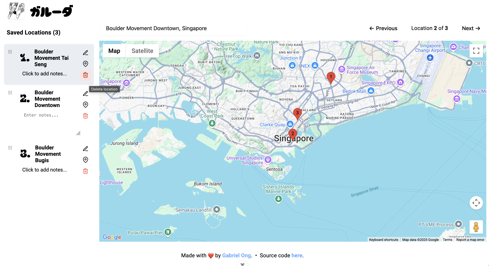
</div>

## Usage

The below instructions are for locally hosting `garuda`.

1. First set up accounts and obtain API keys for the following services.

    1. *[Google Developer Account](https://developers.google.com/)*: For Google Maps Platform API
    2. *[Clerk](https://clerk.com/docs/quickstarts/setup-clerk)*: For authentication
    3. *[Firebase](https://firebase.google.com/)*: For Realtime Database
    4. *[OpenAI Platform](https://platform.openai.com/api-keys)*: For AI Visual Trip Planner (GPT-4o)
    5. *[Supabase](https://supabase.com/)*: For real-time collaborative features

2. Then create a `.env` file in the `garuda-app` directory with the following.

```env
VITE_GOOGLE_MAPS_API_KEY=your_google_maps_api_key_here
VITE_CLERK_PUBLISHABLE_KEY=your_clerk_publishable_key_here
VITE_FIREBASE_API_KEY=your_firebase_api_key_here
VITE_FIREBASE_AUTH_DOMAIN=your_firebase_auth_domain_here
VITE_FIREBASE_DATABASE_URL=your_firebase_database_url_here
VITE_FIREBASE_PROJECT_ID=your_firebase_project_id_here
VITE_FIREBASE_APP_ID=your_firebase_app_id_here
VITE_OPENAI_API_KEY=your_openai_api_key_here
VITE_SUPABASE_URL=your_supabase_url_here
VITE_SUPABASE_ANON_KEY=your_supabase_anon_key_here
```

3. Also create an `.env.local` file in the `garuda-app` directory with the following.

```env
VITE_CLERK_SIGN_IN_URL=/sign-in
VITE_CLERK_SIGN_UP_URL=/sign-up
VITE_CLERK_AFTER_SIGN_IN_URL=/
VITE_CLERK_AFTER_SIGN_UP_URL=/
```

4. Then execute the below.

```console
$ git clone https://github.com/gongahkia/garuda && cd garuda/garuda-app && npm install
$ npm run dev
$ npm run build
$ npm run preview
```

## Architecture

### Overview

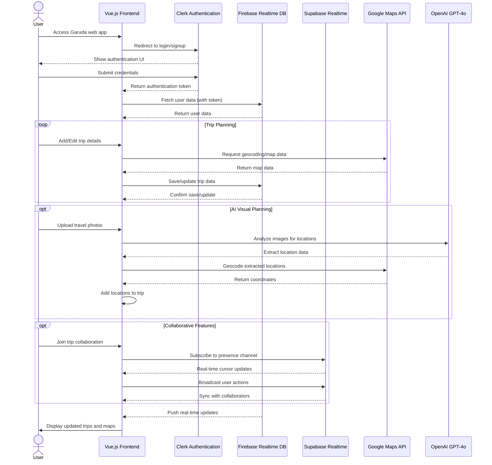

### DB Schema

#### Firebase Realtime Database

```json
{
  "users": {
    "clerkUserId": {
      "profile": {
        "email": "string",
        "displayName": "string",
        "photoURL": "string | null"
      },
      "trips": {
        "tripId": true
      }
    }
  },

  "trips": {
    "tripId": {
      "metadata": {
        "title": "string",
        "startDate": "ISO8601",
        "endDate": "ISO8601",
        "collaborators": {
          "clerkUserId": true
        }
      },
      "locations": {
        "locationId": {
          "id": "string",
          "name": "string",
          "position": {
            "lat": "number",
            "lng": "number"
          },
          "address": "string",
          "type": "string",
          "description": "string",
          "notes": "string",
          "tags": ["string"],
          "metadata": {
            "city": "string",
            "country": "string",
            "confidence": "high | medium | low",
            "source": "manual | ai-vision | search"
          },
          "createdAt": "ISO8601",
          "order": "number"
        }
      }
    }
  }
}
```

#### Supabase Realtime

```typescript
{
  tripId: {
    userId: {
      id: "string",
      name: "string",
      avatar: "string | null",
      color: "string (hex)",
      cursor: {
        x: "number",
        y: "number"
      },
      lastActive: "ISO8601"
    }
  }
}
```

## Reference

The name `Garuda` is in reference to [Garuda](https://jujutsu-kaisen.fandom.com/wiki/Garuda) (凰輪), 
[Yuki Tsukumo](https://jujutsu-kaisen.fandom.com/wiki/Yuki_Tsukumo)'s (九十九 由基) [shikigami](https://jujutsu-kaisen.fandom.com/wiki/Shikigami) that accompanies her [innate technique](https://jujutsu-kaisen.fandom.com/wiki/Category:Innate_Techniques) [Star Rage](https://jujutsu-kaisen.fandom.com/wiki/Star_Rage). Garuda first makes a substantive appearance in the [Yuki Tsukumo & Choso vs. Kenjaku](https://jujutsu-kaisen.fandom.com/wiki/Yuki_Tsukumo_%26_Choso_vs._Kenjaku) battle of the [Culling Game Arc](https://jujutsu-kaisen.fandom.com/wiki/Culling_Game_Arc) as part of the completed manga series [Jujustu Kaisen](https://jujutsu-kaisen.fandom.com/wiki/Jujutsu_Kaisen_Wiki).

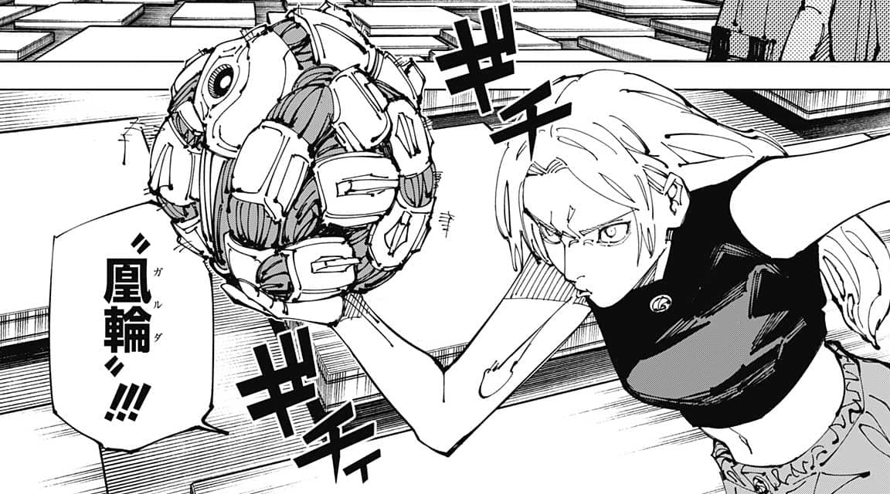

## Other notes

I focused quite a bit on `Garuda`'s [styling](#screenshots) this time, an area I've historically been weak at.

<div align="center">
  
</div>
