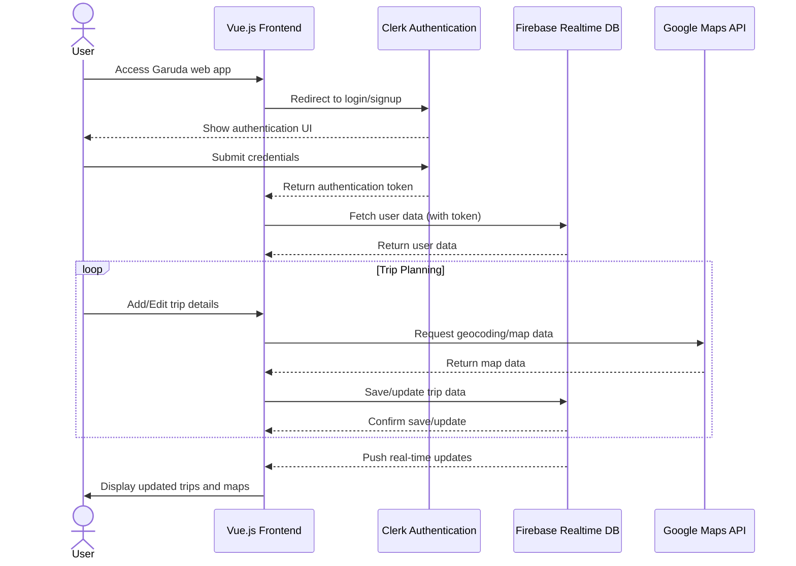

[](https://github.com/gongahkia/garuda/releases/tag/1.0.0) 

# `Garuda`

*"We have [Wanderlog](https://wanderlog.com) at home"*, featuring [user accounts](#login-main-dashboard-add-locations), [dynamic ordering](#reorder-locations-pin-location-delete-location) and [itinerary management](#add-location-notes-edit-notes-cycle-through-locations).

Made to teach myself to work with [vue-google-maps](https://github.com/fawmi/vue-google-maps) and [Google Maps Platform API](https://developers.google.com/maps/documentation/javascript/get-api-key).

## Stack

* *Frontend*: [Vue.js](https://vuejs.org/)
* *DB*: [Firebase Realtime Database](https://firebase.google.com/docs/database)
* *Auth*: [Clerk](https://clerk.com/)
* *API*: [Google Maps Platform API](https://developers.google.com/maps)

## Screenshots

### Login, Main Dashboard, Add Locations

<div style="display: flex; justify-content: space-between;">
  
  
  
</div>

### Add Location Notes, Edit notes, Cycle through Locations

<div style="display: flex; justify-content: space-between;">
  
  
  
</div>

### Reorder Locations, Pin Location, Delete Location

<div style="display: flex; justify-content: space-between;">
  
  
  
</div>

## Usage

First create a [Google Developer Account](https://developers.google.com/).

Then [set up your Clerk account](https://clerk.com/docs/quickstarts/setup-clerk).

Next, create an `.env` file with the following.

```env
VITE_GOOGLE_MAPS_API_KEY=XXX
VITE_CLERK_PUBLISHABLE_KEY=XXX
```

Also create an `.env.local` file with the following.

```env
VITE_CLERK_SIGN_IN_URL=/sign-in
VITE_CLERK_SIGN_UP_URL=/sign-up
VITE_CLERK_AFTER_SIGN_IN_URL=/
VITE_CLERK_AFTER_SIGN_UP_URL=/
```

Then run the below.

```console
$ git clone github.com/gongahkia/garuda
$ cd garuda-app
$ npm i && npm run dev
```

## Architecture

### Overview



### DB

```json
{
  "users": {
    "clerkUserId": {
      "profile": {
        "email": "string",
        "displayName": "string",
        "photoURL": "string | null"
      },
      "trips": {
        "tripId": true
      }
    }
  },
  
  "trips": {
    "tripId": {
      "metadata": {
        "title": "string",
        "startDate": "ISO8601",
        "endDate": "ISO8601",
        "collaborators": {
          "clerkAuthId": true
        }
      }
    }
  },

  "locations": {
    "loc": {
      "placeId": "string (Google Places ID)",
      "name": "string",
      "coordinates": {
        "lat": "number",
        "lng": "number"
      },
      "note": "string",
      "order": "number"
    }
  }
}
```

## Reference

The name `Garuda` is in reference to [Garuda](https://jujutsu-kaisen.fandom.com/wiki/Garuda) (凰輪), 
[Yuki Tsukumo](https://jujutsu-kaisen.fandom.com/wiki/Yuki_Tsukumo)'s (九十九 由基) [shikigami](https://jujutsu-kaisen.fandom.com/wiki/Shikigami) that accompanies her [innate technique](https://jujutsu-kaisen.fandom.com/wiki/Category:Innate_Techniques) [Star Rage](https://jujutsu-kaisen.fandom.com/wiki/Star_Rage). Garuda first makes a substantive appearance in the [Yuki Tsukumo & Choso vs. Kenjaku](https://jujutsu-kaisen.fandom.com/wiki/Yuki_Tsukumo_%26_Choso_vs._Kenjaku) battle of the [Culling Game Arc](https://jujutsu-kaisen.fandom.com/wiki/Culling_Game_Arc) as part of the completed manga series [Jujustu Kaisen](https://jujutsu-kaisen.fandom.com/wiki/Jujutsu_Kaisen_Wiki).


## Other notes

I focused quite a bit on `Garuda`'s [styling](#screenshots) this time, an area I've historically been weak at.


