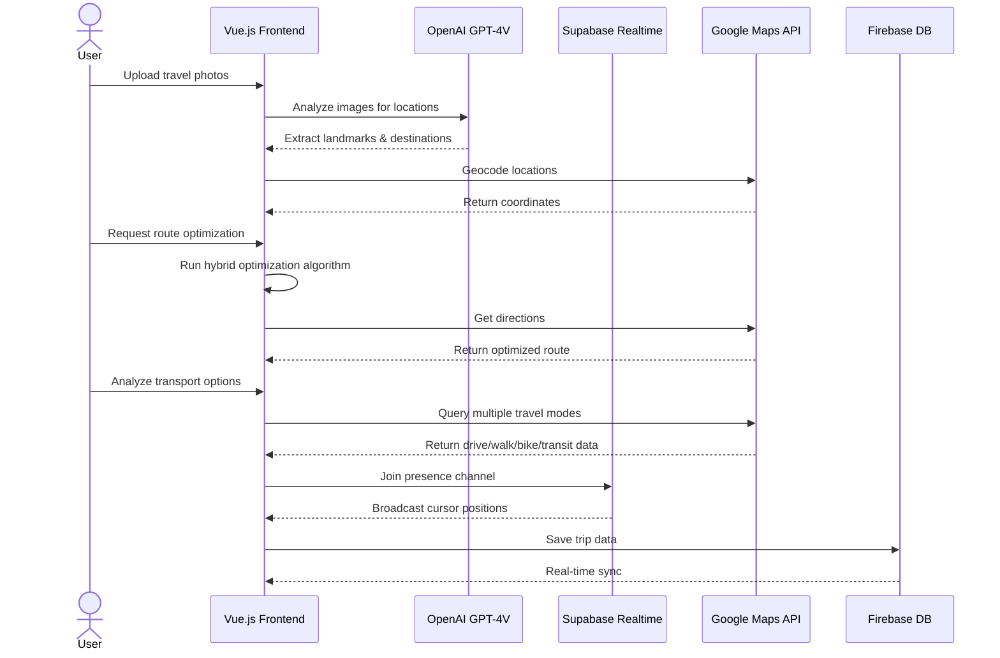

[](https://github.com/gongahkia/garuda/releases/tag/1.0.0) 

# `Garuda`

Next-generation travel itinerary planner with **bleeding-edge AI features**, featuring intelligent route optimization, collaborative planning, and multi-modal transport integration.

## ✨ Core Features

### 🎨 AI Visual Trip Planner
Upload travel inspiration photos and let GPT-4 Vision extract locations automatically.
- **Photo-to-Itinerary**: Upload Pinterest boards, screenshots, or vacation photos
- **Smart Location Extraction**: AI identifies landmarks, restaurants, and destinations
- **Auto-Geocoding**: Instant map placement with confidence scoring
- **Batch Processing**: Handle up to 10 images simultaneously

### 👥 Real-Time Collaborative Cursors
Plan trips together with Figma-style collaboration.
- **Live Cursor Tracking**: See collaborators' movements in real-time (60fps)
- **Presence Indicators**: Know who's online with color-coded avatars
- **Conflict-Free Editing**: Powered by Supabase Realtime
- **Zero Latency**: WebSocket-based synchronization

### 🧠 Neural Route Optimizer
AI-powered route optimization using advanced algorithms.
- **Hybrid Optimization**: Combines Nearest Neighbor, 2-Opt, and Simulated Annealing
- **Distance Minimization**: Save hours with intelligent reordering
- **Multiple Algorithms**: Choose from 4 optimization strategies
- **Real-Time Metrics**: See improvement percentage and distance saved

### 🚗 Multi-Modal Transport Integration
Compare all transport options in one view.
- **4 Travel Modes**: Driving, walking, cycling, and public transit
- **Cost Comparison**: See estimated costs for each mode
- **Carbon Footprint**: Environmental impact tracking with CO₂ ratings
- **Transit Details**: Line numbers, transfers, and schedules
- **Smart Recommendations**: AI suggests best mode based on distance

### 📍 Classic Features
- **User Accounts** with Clerk authentication
- **Dynamic Ordering** with drag-and-drop
- **Location Notes** with inline editing
- **Interactive Map** with Google Maps integration

## 🛠️ Stack

### Core
* **Frontend**: [Vue.js 3](https://vuejs.org/) with Composition API
* **Styling**: SCSS with scoped components
* **Build Tool**: [Vite](https://vitejs.dev/)

### APIs & Services
* **Maps**: [Google Maps Platform API](https://developers.google.com/maps)
* **AI Vision**: [OpenAI GPT-4 Vision](https://platform.openai.com/docs/guides/vision)
* **Real-time**: [Supabase](https://supabase.com/) (Presence & WebSockets)
* **Auth**: [Clerk](https://clerk.com/)
* **Database**: [Firebase Realtime Database](https://firebase.google.com/docs/database)

### Key Libraries
* `@fawmi/vue-google-maps` - Google Maps integration
* `openai` - GPT-4 Vision API
* `@supabase/supabase-js` - Real-time collaboration
* `vuedraggable` - Drag-and-drop lists
* `axios` - HTTP client

## Screenshots

### Login, Main Dashboard, Add Locations

<div style="display: flex; justify-content: space-between;">
  
  
  
</div>

### Add Location Notes, Edit notes, Cycle through Locations

<div style="display: flex; justify-content: space-between;">
  
  
  
</div>

### Reorder Locations, Pin Location, Delete Location

<div style="display: flex; justify-content: space-between;">
  
  
  
</div>

## 🚀 Quick Start

### Prerequisites
1. [Google Developer Account](https://developers.google.com/) - For Maps API
2. [OpenAI API Key](https://platform.openai.com/api-keys) - For AI Vision features
3. [Supabase Project](https://supabase.com/) - For real-time collaboration
4. [Clerk Account](https://clerk.com/docs/quickstarts/setup-clerk) - For authentication
5. [Firebase Project](https://firebase.google.com/) - For database

### Environment Setup

Create an `.env` file in `garuda-app/`:

```env
# Google Maps
VITE_GOOGLE_MAPS_API_KEY=your_google_maps_api_key

# Clerk Auth
VITE_CLERK_PUBLISHABLE_KEY=your_clerk_key

# Firebase
VITE_FIREBASE_API_KEY=your_firebase_key
VITE_FIREBASE_AUTH_DOMAIN=your-project.firebaseapp.com
VITE_FIREBASE_DATABASE_URL=https://your-project.firebaseio.com
VITE_FIREBASE_PROJECT_ID=your-project-id
VITE_FIREBASE_APP_ID=your_app_id

# OpenAI (for AI Visual Planner)
VITE_OPENAI_API_KEY=your_openai_api_key

# Supabase (for Collaborative Cursors)
VITE_SUPABASE_URL=your_supabase_url
VITE_SUPABASE_ANON_KEY=your_supabase_anon_key
```

Create `.env.local` file:

```env
VITE_CLERK_SIGN_IN_URL=/sign-in
VITE_CLERK_SIGN_UP_URL=/sign-up
VITE_CLERK_AFTER_SIGN_IN_URL=/
VITE_CLERK_AFTER_SIGN_UP_URL=/
```

### Installation

```bash
git clone https://github.com/gongahkia/garuda
cd garuda/garuda-app
npm install
npm run dev
```

Visit `http://localhost:5173` to see Garuda in action!

### 🔐 API Key Notes

**Google Maps API** - Enable these APIs in your project:
- Maps JavaScript API
- Places API
- Directions API
- Geocoding API

**OpenAI API** - Requires GPT-4 Vision access (paid tier)

**Supabase** - Enable Realtime in your project settings

## 🏗️ Architecture

### System Overview



### Feature Architecture

**AI Visual Planner Flow:**
1. User uploads images (drag-and-drop or click)
2. Convert to base64 for OpenAI API
3. GPT-4 Vision extracts location data with confidence scores
4. Google Maps Geocoding API converts names to coordinates
5. Deduplicate and filter low-confidence results
6. Display results with type badges and descriptions

**Route Optimizer Flow:**
1. Calculate current route distance (Haversine formula)
2. Apply Nearest Neighbor heuristic for initial solution
3. Improve with 2-Opt local optimization
4. Further optimize with Simulated Annealing
5. Compare original vs optimized distance
6. Apply changes or cancel

**Collaborative Cursors Flow:**
1. Generate unique user ID and color on load
2. Initialize Supabase presence channel with trip ID
3. Throttle mouse movements to 60fps
4. Broadcast cursor coordinates via WebSocket
5. Render remote cursors with SVG pointers
6. Show avatars and names above cursors

**Multi-Modal Transport Flow:**
1. User selects route segment
2. Query Google Directions API for all modes
3. Calculate cost estimates per mode
4. Calculate carbon footprint (kg CO₂)
5. Rank options by time, cost, and environment
6. Display transit details (lines, transfers)

### DB

```json
{
  "users": {
    "clerkUserId": {
      "profile": {
        "email": "string",
        "displayName": "string",
        "photoURL": "string | null"
      },
      "trips": {
        "tripId": true
      }
    }
  },
  
  "trips": {
    "tripId": {
      "metadata": {
        "title": "string",
        "startDate": "ISO8601",
        "endDate": "ISO8601",
        "collaborators": {
          "clerkAuthId": true
        }
      }
    }
  },

  "locations": {
    "loc": {
      "placeId": "string (Google Places ID)",
      "name": "string",
      "coordinates": {
        "lat": "number",
        "lng": "number"
      },
      "note": "string",
      "order": "number"
    }
  }
}
```

## Reference

The name `Garuda` is in reference to [Garuda](https://jujutsu-kaisen.fandom.com/wiki/Garuda) (凰輪), 
[Yuki Tsukumo](https://jujutsu-kaisen.fandom.com/wiki/Yuki_Tsukumo)'s (九十九 由基) [shikigami](https://jujutsu-kaisen.fandom.com/wiki/Shikigami) that accompanies her [innate technique](https://jujutsu-kaisen.fandom.com/wiki/Category:Innate_Techniques) [Star Rage](https://jujutsu-kaisen.fandom.com/wiki/Star_Rage). Garuda first makes a substantive appearance in the [Yuki Tsukumo & Choso vs. Kenjaku](https://jujutsu-kaisen.fandom.com/wiki/Yuki_Tsukumo_%26_Choso_vs._Kenjaku) battle of the [Culling Game Arc](https://jujutsu-kaisen.fandom.com/wiki/Culling_Game_Arc) as part of the completed manga series [Jujustu Kaisen](https://jujutsu-kaisen.fandom.com/wiki/Jujutsu_Kaisen_Wiki).


## Other notes

I focused quite a bit on `Garuda`'s [styling](#screenshots) this time, an area I've historically been weak at.

<div align="center">
  
</div>
